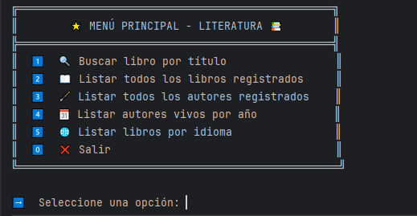
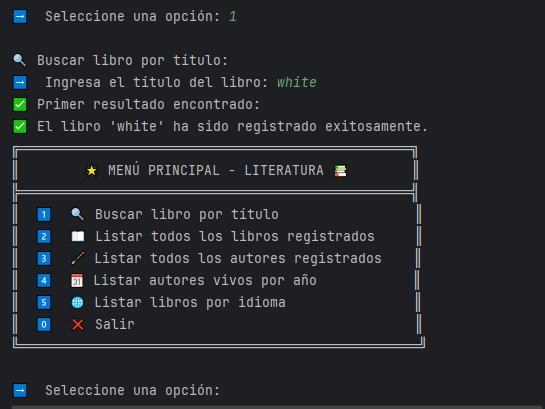
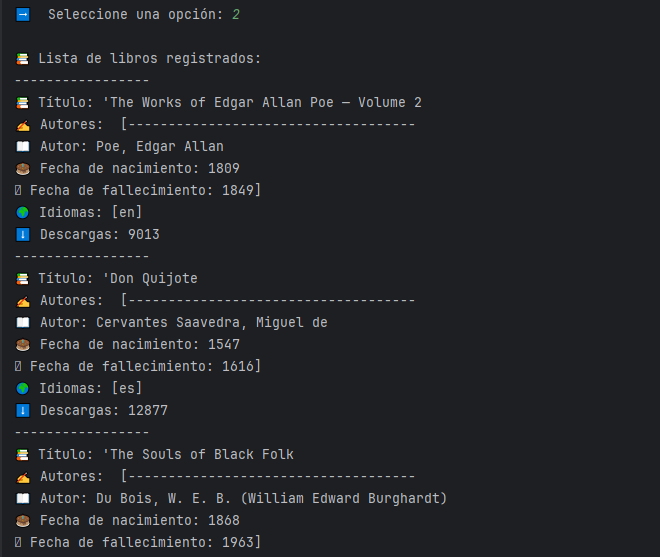
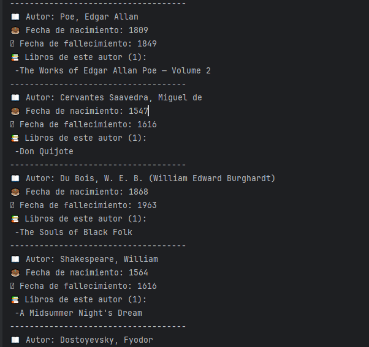
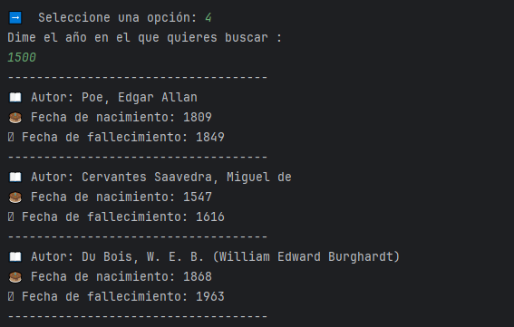

# 📚 LiterAlura: Catálogo de Libros

¡Bienvenido a **LiterAlura**, una aplicación diseñada para interactuar con un catálogo de libros de manera dinámica y textual! Este proyecto combina el poder de **Java**, **Spring Boot**, **JPA**, y **PostgreSQL** para ofrecer una experiencia única a los usuarios. 🎉

---

## 🌟 Descripción del Proyecto

**LiterAlura** es un catálogo de libros interactivo que permite a los usuarios:

- 🔍 Buscar libros por título a través de una API.
- 📖 Consultar información detallada sobre libros y autores.
- 🗂️ Listar libros por idioma o autores vivos desde un año específico.
- 💾 Guardar y recuperar datos de una base de datos.

### Principales Funcionalidades

1. 🔍 **Buscar libro por título**: Encuentra libros en tiempo real desde la API.
2. 📖 **Listar libros registrados**: Muestra todos los libros almacenados en la base de datos.
3. 🖋️ **Listar autores registrados**: Descubre los autores relacionados con los libros.
4. 🗓️ **Listar autores vivos desde un año específico**: Filtra autores por año de nacimiento.
5. 🌐 **Listar libros por idioma**: Explora libros en diferentes idiomas.

---

## 🛠️ Tecnologías Utilizadas

- **Lenguaje:** Java 17  
- **Framework:** Spring Boot  
- **ORM:** JPA con Spring Data  
- **Base de Datos:** PostgreSQL  
- **Consumo de API:** Uso de `RestTemplate` para obtener datos JSON desde la API de [GutenDex](https://gutendex.com).  

---

## 🚀 Configuración del Proyecto

### Clonar el Repositorio
```bash
git clone https://github.com/usuario/literalura.git
Configuración de Base de Datos
Configura PostgreSQL en tu sistema.
Actualiza las credenciales en el archivo application.properties dentro de la carpeta src/main/resources.
Ejecución del Proyecto
bash
Copiar código
mvn spring-boot:run
Interacción con la Consola
La interacción se realiza a través de un menú intuitivo que guía al usuario por las opciones disponibles.

🌐 Menú Principal
plaintext
Copiar código
🌟 MENÚ PRINCIPAL - LITERATURA 📚
1️⃣ 🔍 Buscar libro por título
2️⃣ 📖 Listar todos los libros registrados
3️⃣ 🖋️ Listar todos los autores registrados
4️⃣ 🗓️ Listar autores vivos por año
5️⃣ 🌐 Listar libros por idioma
0️⃣ ❌ Salir
➡️ Seleccione una opción:
📂 Estructura del Código
model: Define las entidades de la base de datos.
repository: Gestiona las operaciones CRUD con JPA.
service: Contiene lógica para consumir la API y convertir datos JSON.
principal: Controla la interacción con el usuario y define el flujo principal de la aplicación.
📸 Capturas de Pantalla
## 📸 Capturas de Pantalla

### Menú Principal


### Buscar Libro


### Listar Libros


### Listar Autores


### Listar Autores por Año


### Listar Libros por Idioma


💡 Futuras Mejoras
Crear una interfaz gráfica con JavaFX.
Añadir soporte para múltiples bases de datos.
Implementar autenticación y manejo de usuarios.
